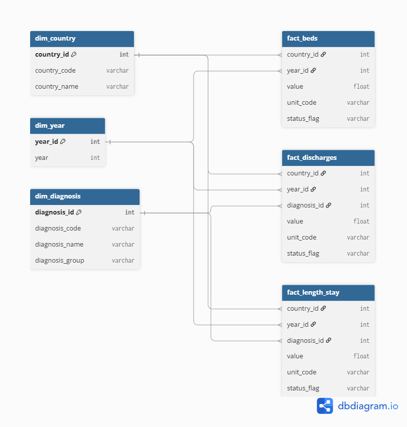

# Methodology  

## Data Model

The project uses a star schema with three fact tables and three shared dimension tables. 

### Fact table grain  

- `fact_beds`: one row per country and year.
- `fact_discharges`: one row per country, year and diagnosis group.
- `fact_length_stay`: one row per country, year and diagnosis group.

### Dimensions  

- `dim_country`: one row per selected country.
- `dim_year`: one row per year in the analysis period.
- `dim_diagnosis`: one row per selected diagnosis group.

### Keys and constraints

Dimension tables use surrogate integer primary keys:

- `dim_country.country_id`
- `dim_year.year_id`
- `dim_diagnosis.diagnosis_id`

Fact tables use composite primary keys that enforce their declared grain:

- `fact_beds`: (`country_id`, `year_id`)
- `fact_discharges`: (`country_id`, `year_id`, `diagnosis_id`)
- `fact_length_stay`: (`country_id`, `year_id`, `diagnosis_id`)

Each dimension key used in a fact table is also a foreing key. This prevents observations from referencing a country, year or diagnosis that does not existe in its corresponding dimension table.

